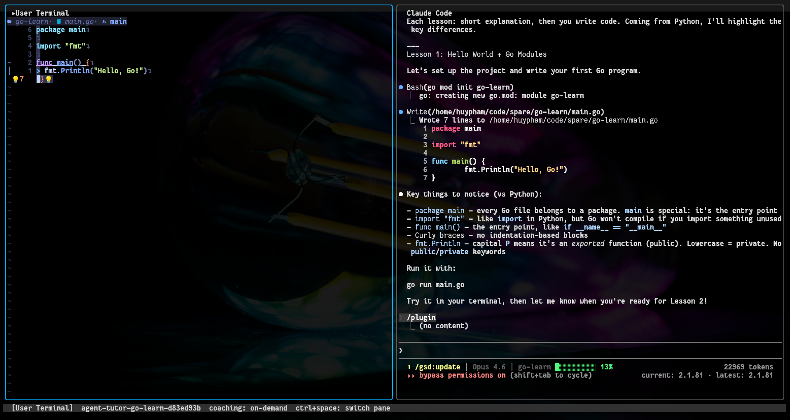

# Agent Tutor

A Go CLI that turns coding agents (Claude Code, Codex) into programming tutors by observing your work via tmux and MCP.



## How it works

Agent Tutor creates a tmux session with two panes: your terminal on the left, a coding agent on the right. An MCP server runs in the background, feeding the agent observation tools (file changes, terminal output, git activity). A system prompt injection makes the agent coach you instead of just writing code for you.

You can interact with the session in two ways:
- **TUI mode** — a built-in terminal UI that renders both panes in one window (shown above)
- **tmux attach** — attach directly to the tmux session for a native terminal experience

## Installation

```
go install github.com/huypl53/agent-tutor/cmd/agent-tutor@latest
```

Requires tmux and git on your PATH.

## Quick start

```
agent-tutor start ~/myproject
```

This opens a tmux session. Work in the left pane as normal. The agent in the right pane can observe what you're doing and offer guidance based on the coaching intensity level.

Type `/atu:check` in the agent pane to request feedback on your current work.

## Commands

| Command | Description |
|---------|-------------|
| `agent-tutor start [project-dir]` | Start a tutoring session (defaults to current directory) |
| `agent-tutor start --tui [project-dir]` | Start session and launch the TUI instead of tmux attach |
| `agent-tutor tui [project-dir]` | Launch TUI for an existing session |
| `agent-tutor stop [project-dir]` | Stop the tutoring session for a project (defaults to cwd) |
| `agent-tutor status [project-dir]` | Check if a tutoring session is running for a project |
| `agent-tutor install-plugin [--scope]` | Install Claude Code plugin and tutor instructions |
| `agent-tutor uninstall-plugin [--scope]` | Remove Claude Code plugin and tutor instructions |

## Plugin Installation

Agent-tutor includes a Claude Code plugin with coaching slash commands. It is auto-installed on `agent-tutor start`, or you can install it manually:

```bash
# Install in current project (default)
agent-tutor install-plugin

# Install globally for all projects
agent-tutor install-plugin --scope global

# Remove
agent-tutor uninstall-plugin
```

### Slash Commands

| Command | Description |
|---------|-------------|
| `/atu:check` | Comprehensive review of recent coding activity |
| `/atu:hint` | Quick nudge — one teaching point |
| `/atu:explain` | Explain the most recent error or output |
| `/atu:save` | Save a lesson to `./lessons/` for later review |
| `/atu:debug` | Guided debugging session (4-phase methodology) |
| `/atu:review` | Self-review coaching with graduated checklist |
| `/atu:decompose` | Problem decomposition coaching |
| `/atu:workflow` | Development workflow habit coaching |

## Lesson Export

Agent Tutor saves structured lesson files to `./lessons/` in your project directory so you can review what you learned.

**On-demand:** Type `/atu:save goroutines` in the agent pane to explicitly save a lesson about a topic.

**Automatic:** Lessons are also saved automatically after `/atu:check` feedback and after git commit coaching nudges. The tutor instructions in CLAUDE.md tell the agent to write a lesson file whenever it gives substantive coaching feedback.

Each lesson file follows this structure:

    # Topic Title

    **Date:** 2026-03-24
    **Topic:** category
    **Trigger:** manual|check|commit|nudge

    ## What I Learned
    ## Code Example
    ## Key Takeaway
    ## Common Mistakes

Lessons are saved to your project directory. Add `lessons/` to `.gitignore` to keep them local, or commit them to share with others.

## TUI Mode

Agent Tutor includes a built-in terminal UI (powered by [bubbletea](https://github.com/charmbracelet/bubbletea)) that renders both panes in a single terminal window with customizable layout.

```bash
# Start session and launch TUI
agent-tutor start --tui ~/myproject

# Or launch TUI for an existing session
agent-tutor tui ~/myproject
```

- **`Ctrl+Space`** — Switch focus between panes (customizable)
- **`Ctrl+Q`** — Quit the TUI (session keeps running in the background)
- Reattach anytime with `agent-tutor tui` or `tmux -L agent-tutor attach`

The TUI uses adaptive polling: 50ms refresh when you're actively typing, slowing to 200ms when idle.

## Configuration

Agent Tutor stores config in `.agent-tutor/config.toml` inside your project directory. A default config is created on first run.

```toml
[tutor]
intensity = "on-demand"   # proactive, on-demand, or silent
level = "auto"            # student level hint (auto, beginner, intermediate, advanced)

[agent]
command = "claude"        # coding agent command
args = []

[watchers]
file_patterns = ["**/*.go", "**/*.py", "**/*.js", "**/*.ts", "**/*.rs"]
ignore_patterns = ["node_modules", ".git", "vendor", "target"]
terminal_poll_interval = "2s"
git_poll_interval = "5s"

[tmux]
layout = "horizontal"
user_pane_size = 50
socket = "agent-tutor"       # isolated tmux server socket name

[tui]
layout = "horizontal"        # horizontal | vertical
split_ratio = 50             # percentage for first pane
focus_key = "ctrl+space"     # switch focus between panes
quit_key = "ctrl+q"          # quit the TUI

[tui.polling]
active_ms = 50               # refresh rate when actively typing
idle_ms = 200                # refresh rate when idle
idle_threshold_s = 10         # seconds before switching to idle rate
```

## Coaching intensity levels

- **silent** -- The agent never coaches unless you explicitly ask.
- **on-demand** -- The agent uses tutor tools only when you ask for feedback or type `/atu:check`.
- **proactive** -- The agent periodically checks your context and offers coaching when it spots teachable moments (errors, anti-patterns, etc.).

## Testing

Run unit tests:

```bash
go test ./...
```

Run E2E integration tests (requires tmux):

```bash
go test -tags integration ./internal/integration/ -v -timeout 60s
```

## How it works (technical)

The `start` command creates an isolated tmux session (via `tmux -L agent-tutor`), splits it into two panes, auto-installs the embedded plugin if not already present, and launches the coding agent with `--mcp-config` (MCP server) and `--plugin-dir` (slash commands). Each project gets a unique session name (`agent-tutor-<basename>-<hash>`), so you can run multiple tutoring sessions concurrently across different projects. Using a dedicated tmux socket prevents interference with your existing tmux sessions. The MCP server:

1. **Watchers** (file, terminal, git) observe the student's activity and push events into a ring-buffer context store.
2. **MCP tools** (`get_student_context`, `get_recent_file_changes`, `get_terminal_activity`, `get_git_activity`, `get_coaching_config`, `set_coaching_intensity`) let the agent query that store.
3. A **trigger engine** fires nudge events when patterns are detected (e.g., repeated errors), prompting proactive coaching.
4. A **system prompt** injected via MCP server instructions tells the agent how to behave as a tutor.
